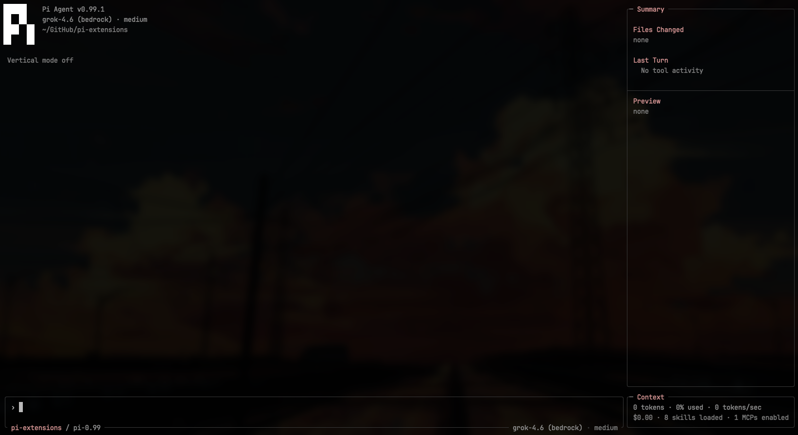
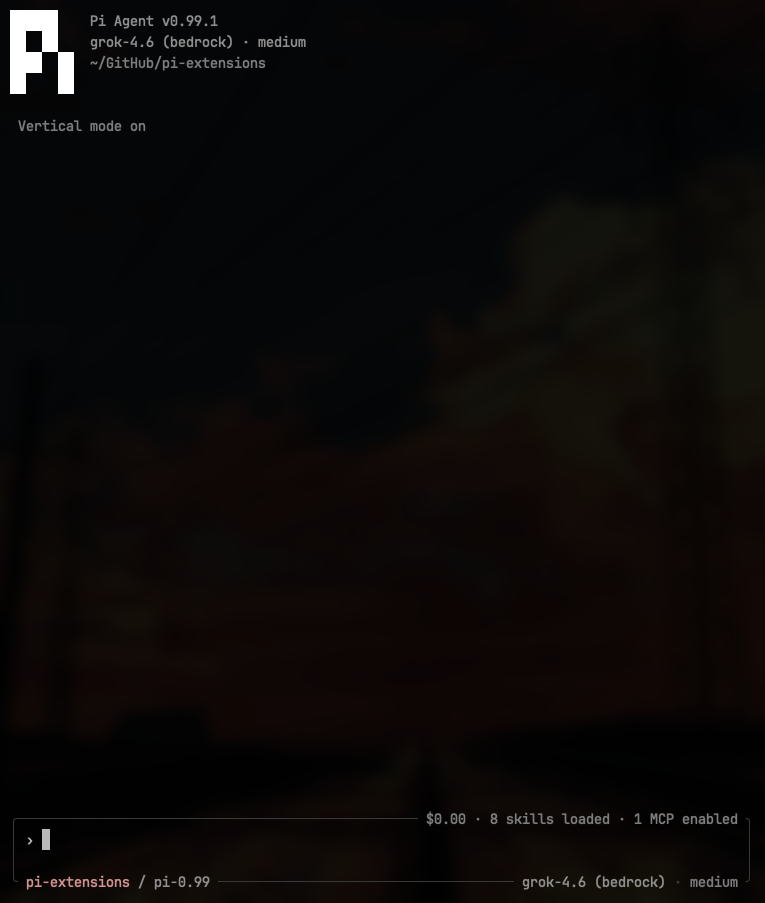
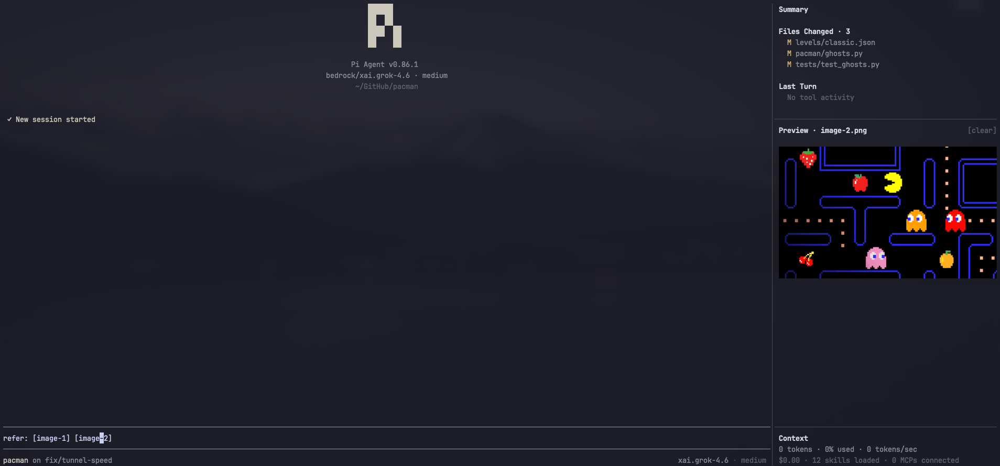
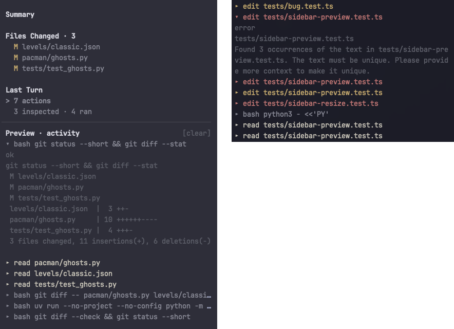
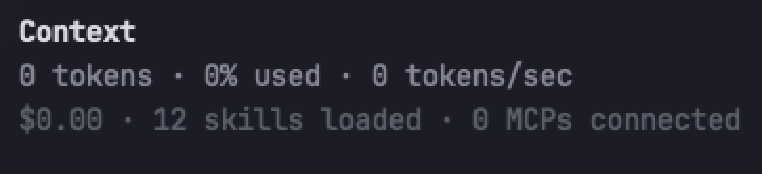

<h1 align="center">Slate 🌱</h1>

<p align="center">
  A minimal terminal UI/UX for Pi Coding Agent with a vertical-first workspace, contextual sidebar, rich media, and quiet update notices.
</p>

<p align="center">
  
</p>

## Setup

**Option 1: Pi-agent Prompt**

```text
- Save my pi-agent's tui and themes and safely disable them for now.
- Install pi-slate using: `pi install npm:pi-slate` and enable fullscreen mode.
- pi-slate replaces Pi's existing TUI; resolve any conflicts. Ask me to /reload session once complete.
```

**Option 2: Bash**

```bash
pi install npm:pi-slate
pi --tui-mode fullscreen
```

Explore extension settings using `/slate` after installation.

## Features

Slate renders cleanly into your terminal and stays customizable without adding tools, prompts, model calls, or context bloat.

### Vertical-first Workspace

Vertical mode is the default. It unmounts the sidebar, gives chat the full window, and keeps the prompt compact.

- `/vertical` toggles vertical mode.
- `/slate vertical [on|off]` sets the saved vertical-mode state.
- Choosing a sidebar width returns to standard sidebar mode.
- Working status stays on the left of the prompt's top edge.
- When skills or MCPs are present, spend and nonzero counts stay on the right of the prompt's top edge.
- Token usage uses the compact footer format: `47,349 tokens (5%) · 845 tokens/sec`.

The tall vertical screenshot is constrained so it does not dominate the page:

<p align="center">
  
</p>

### Rich Media Rendering

Slate uses Kitty Graphics Protocol to display rich media inside your terminal.

> Usage: Caret-peek over text to display. Click Preview to copy a path. Double-click to open or edit. Pi-generated clipboard image paths are converted into `[image-N]` tokens.

<p align="center">
  
</p>

### Interactive Observability

Inspect work-tree files and recent request activity directly from the terminal.

> Usage: Single-click to preview files or drill into activity categories. Double-click to open files in your editor. Expand activity entries to inspect detailed tool executions.

<p align="center">
  
</p>

### Session Context Overview

Slate keeps usage and spend visible without sending context to your LLM.

- Standard mode keeps detailed token, rate, spend, skill, and MCP facts in the sidebar's Context dock.
- Vertical mode uses the shorter prompt-edge format and hides the resource summary when no skills or MCP servers are loaded.
- MCP counts come from Pi's native global `mcp.json` and project `.pi/mcp.json` files.
- Project MCP entries override global entries with the same name; `enabled: false` and `disabled: true` are respected.
- Context usage may be estimated when provider usage is unavailable.

<p align="center">
  
</p>

### Update Notices

Pi and package updates appear as a centered hairline in the Slate header. Duplicate stock Pi/package update cards are removed from the transcript, keeping chat focused on the conversation.

### Themes

The prompt, Summary, and Context share one frame. The Pi logo stays white in every theme.

Black Metal is the install default. Catppuccin Mocha styles: Default, Quiet, Mauve, Sapphire, Peach, Teal.

`/slate` → Theme picks one. Or set it directly:

```text
/slate theme mauve
/slate style quiet
```

Selection is saved and also appears in `/settings`.

### Composer Keys

These work from the prompt after `pi install npm:pi-slate`. No terminal configuration.

| Action | Keys |
| --- | --- |
| Select all prompt text | `Ctrl+A` |
| Copy selected prompt | selected `Ctrl+C` |
| Cut selected prompt | selected `Ctrl+X` |
| Replace selection | Type, Backspace, or paste |
| Submit selected prompt | `Enter` |
| Clear the prompt | `Esc` `Esc` |
| Expand a collapsed paste | Click the `[paste #N]` token |

`Ctrl+A` selects the whole prompt instead of jumping to the line start; `Home` still does that. Copy uses the expanded paste body. Unselected `Ctrl+C` and `Ctrl+X` keep Pi's normal behavior. Image tokens stay as `[image-N]`. Clicking a paste token only reveals that token in the composer; submit text is unchanged.

## Commands

`/slate` with no args opens the settings picker.

| Setting | Commands | Effect |
| --- | --- | --- |
| Vertical | `/vertical` or `/slate vertical [on\|off]` | Toggle or set vertical mode. Vertical mode hides the sidebar; standard mode restores it. |
| Sidebar width | `/slate width [default\|narrow\|medium\|wide\|<percent>]` | Choose the sidebar width and return to standard mode. `default` is 20%. |
| Message length | `/slate message-length [default\|all\|<count>]` | How many chat messages stay on screen. `default` is 100. |
| Density | `/slate density [comfortable\|compact]` | Comfortable shows a › prompt in the composer; compact is tighter. |
| Footer | `/slate footer [standard\|minimal]` | Standard shows model and thinking on the composer; minimal hides them. |
| Theme | `/slate theme [default\|quiet\|mauve\|sapphire\|peach\|teal]` | Catppuccin Mocha style. `/slate style` does the same. |
| Bugs | `/slate bug [file\|open]` | Copy a bug report, or open the npm package page. |

## Model Display

`~/.pi/agent/pi-slate.json` accepts a `modelDisplay` object to restyle model labels in the header and composer footer. It is provider-agnostic and display-only; the model id sent to the API never changes.

```json
{
  "modelDisplay": {
    "stripPrefixes": ["us.", "eu.", "global.", "anthropic.", "xai.", "moonshotai."],
    "providerAliases": { "bedrock-runtime": "bedrock", "bedrock-priority": "bedrock" },
    "providerSuffix": true
  }
}
```

- `stripPrefixes`: literal prefixes removed from displayed model ids, applied repeatedly. `us.moonshotai.kimi-k3` becomes `kimi-k3`.
- `providerAliases`: renames a provider for display. Aliased providers collapse to the same label.
- `providerSuffix`: renders `kimi-k3 (bedrock)` instead of `bedrock/kimi-k3` in both the header and the footer.

## Minimal By Design

Slate adds no context bloat; no tools, prompts, or model calls. It's entirely deterministic and made to be customizable and improve your Pi experience while your Pi remains yours.

## Requirements

- Pi Coding Agent and a modern terminal that can render Kitty or iTerm2 image protocol, such as Ghostty or Warp.
- Disable other UI extensions or ask your agent to merge them. Slate replaces Pi's header, footer, and editor. Extensions that replace the same surfaces may conflict.
- Copy a bug report with `/slate bug`.

## License

[MIT](LICENSE)
